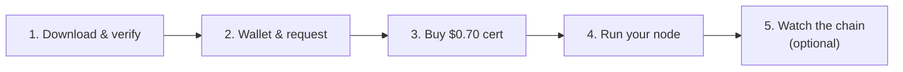

# Become a 7fchain Testnet Miner

7fchain is live on **testnet** - this is how you join it. Testnet is where we harden the network together before mainnet: you run a real miner, earn testnet 7fCOIN (no monetary value yet), and help us prove out the software, the payment rails, and the automated certificate registrar. It runs on an ordinary computer - no GPU, no special hardware.

**You'll need Ubuntu Linux** - either directly, or on a Windows machine via **Windows Subsystem for Linux (WSL)** ([install guide](install-wsl.md)). macOS and ARM Linux builds are also available.

> **Testnet vs. mainnet.** On testnet it's fine to run everything on your normal machine - nothing of value is at stake, so it's the place to practice. **For mainnet you'll want your keys on an air-gapped machine** - see [Securing your keys for mainnet](securing-your-keys.md).

## 1. Download and verify

Download the build from the [latest Release](https://github.com/Seven-Fortunas/7fchain/releases/latest) and check it against the published `SHA256SUMS` before running. The bundle includes the `sf-node`/`sf-wallet`/`sf-explorer` programs plus the public network files (the genesis and dev-fund configs); the trusted root keys are built into the node. (Your certificate and the chain that validates it arrive later, in step 3.) Unzip it and run `./setup.sh` once - it installs the programs and lays out your node folders.
→ **Step-by-step:** [Verify your download](verify-your-download.md)

## 2. Create your wallet and miner request

Run `sf-wallet` to create your wallet (save your recovery phrase somewhere safe) and produce a miner request file. Your keys never leave your machine, and the request file contains no secrets.
→ **Step-by-step:** [Create your wallet & request](create-wallet-and-request.md)

## 3. Buy your testnet certificate ($0.70)

A certificate is what lets your node join and mine; a testnet one costs **$0.70**. We're not charging to make money - the fee exists so we can beta-test our payment system and automated registrar end to end. You submit your request, pay, and get back your certificate **plus the chain that validates it**, automatically.
→ **Step-by-step:** [Buy a testnet certificate](buy-a-testnet-certificate.md)

## 4. Run your node

Drop in the certificate and chain you received, then start the node - it joins the network, catches up to the current tip, and begins mining. Blocks you win pay your reward address.
→ **Step-by-step:** [Run your node](run-your-node.md)

## 5. Watch the chain (optional)

Run a local block explorer to see blocks, transactions, and your node's progress in your browser.
→ **Step-by-step:** [Run your own explorer](run-an-explorer.md)

## Good to know

- **It's testnet.** Testnet 7fCOIN has no monetary value - this is for practice and to help harden the network.
- **Your coins are yours.** Your spending keys are separate from your node's identity, so even if a certificate is revoked, coins already paid to your address stay yours.
- **Per-cert block cap.** Each certificate mines a limited number of blocks over its life; when it's used up, buy another.
- **Cooldown.** After you mine a block, your certificate waits a while before it can mine again - spreading rewards across the community so small miners get a fair share.

For the full design, see the [L1 White Paper](../papers/7fchain-l1-white-paper.md).