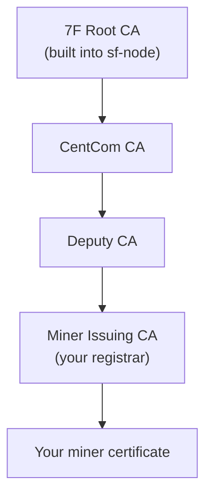

# Run Your Node

This is **step 4** of [Become a miner](become-a-miner.md). It assumes you've run `./setup.sh`, created your wallet and request ([step 2](create-wallet-and-request.md)), and received your signed certificate ([step 3](buy-a-testnet-certificate.md)).

The certificate your registrar returns slots into a chain of trust that runs up to a root key built into `sf-node`. The node verifies this chain at startup before it will mine.



## 1. Put your certificate and its chain in place

The certificate store returns **two things**: your signed certificate and the certificate chain that validates it. Put them where the node looks:

- your certificate → `~/7fchain/testnet/l1/miner-0/`
- the chain certificates → `~/7fchain/testnet/l1/intermediate-certs/`

The exact filenames are shown in the certificate store after purchase. The genesis and dev-fund files are already in place from `setup.sh`.

## 2. Create your node config

```
sf-node init ~/7fchain/testnet/l1
```

This writes `node-config.json`, pointing the node at your `miner-0/` certificate and the `intermediate-certs/` chain. You only do this once.

## 3. Start the node

```
sf-node start ~/7fchain/testnet/l1/node-config.json
```

Enter your **node-startup password** (the one you set in step 2 of the wallet guide). At boot the node verifies your certificate chains to a trusted root, connects to the network's peers, catches up to the current tip, and **then** begins mining. It won't mine until it's synced - if peers aren't reachable yet it waits, which is normal. Blocks you win pay your reward address.

Leave it running to keep mining. Stop it with `Ctrl-C`; start it again the same way.

## Good to know

- You enter your node-startup password every time you start the node.
- Each certificate can mine a limited number of blocks; when it's used up, buy another (use a new `--miner-index` for a fresh identity).
- Run more than one miner by repeating the wallet + certificate steps with `--miner-index 1`, `2`, … - each gets its own certificate.

## Trouble?

- **"command not found"** - open a new terminal so your `PATH` picks up the programs `setup.sh` installed.
- **Stuck "waiting for a trusted peer"** - the network's peers may be down or unreachable; the node will connect and sync automatically once they're back.
