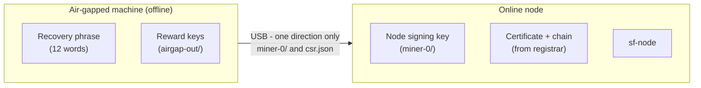

# Securing Your Keys for Mainnet

> **This is mainnet guidance.** On **testnet**, ignore all of this - run everything on one ordinary machine and practice. The extra care here is for **mainnet, where your coins have real value.** (Mainnet isn't live yet; this is how you'll set up when it launches.)

## The idea: keep the keys that control money offline

The safest setup uses **two machines**:




- a **cold machine** - an air-gapped computer that **never connects to the internet** (no Wi-Fi, no ethernet). An old laptop you're no longer using is ideal: wipe it and install Ubuntu fresh [3], then keep it off all networks. It generates and holds your keys.
- a **hot node** - your normal, online computer that runs `sf-node` and mines.

Only the things the node actually needs cross from cold to hot. The things that control your money never leave the cold machine.

| Item | Where it lives | What it controls |
|---|---|---|
| **Recovery phrase** (12 words) | Cold - protected like a critical secret (see below) | Everything. Whoever has it has all your keys. |
| **Reward (spending) keys** (`airgap-out/`) | Cold - never moves | Spending the 7fCOIN you mine. |
| **Node signing key** (`miner-0/`, encrypted) | Copied to the hot node | Signing blocks as your node (encrypted with your node-startup password). |
| **Certificate + chain** | On the hot node | Public - lets your node join and mine. |
| **Request** (`csr.json`) | Public - safe to move anywhere | Nothing secret; it's what you submit to get a certificate. |

## Why this is safe

7fchain keeps **money keys separate from node identity** (see the [L1 White Paper](../papers/7fchain-l1-white-paper.md)). So even if your online node is fully compromised, the attacker **cannot move your coins** (the spending key is on the cold machine) and **cannot redirect your rewards** (your payout address is fixed inside your certificate). The worst they can do is disrupt that one node - a contained incident, not a loss of funds.

## Backing up your recovery phrase

Your recovery phrase restores every key you have. Protect it as you would a critically important secret, **scaled to how much value it guards**:

- For a **small amount**, that might mean writing the words on paper and putting them in a safe.
- For a **large amount**, it might mean stamping the words onto **metal plates** (fireproof and waterproof) sealed with **tamper-evident stickers**, and **splitting them across separate locations** - for example, some of the words in a safe at home and the rest in a safety-deposit box at a bank - so no single place ever holds the whole phrase [1].

> **A note on hardware wallets.** Electronic hardware wallets such as Ledger and Trezor are built for Bitcoin- and Ethereum-style keys and **do not yet support 7fchain's post-quantum keys** - don't rely on one for 7fchain. Today, secure physical backup of your recovery phrase (paper or metal) is the method.

## The workflow

**On the cold (air-gapped) machine** - carry the verified programs in on a clean USB drive [2], then:

```
cd ~/7fchain/mainnet/l1
sf-wallet init --network mainnet     # back up the recovery phrase (see above)
sf-wallet csr                        # set passwords, generate (same menu as testnet)
```

This produces, as on testnet: `miner-0/` (your encrypted node key), `csr-out/miner-0/csr.json` (public request), and `airgap-out/miner-0/` (your **secret reward keys**).

**Carry to the hot node** (USB, one direction [2]): copy **`miner-0/`** and **`csr.json`** over. **Leave the recovery phrase and `airgap-out/` on the cold machine** - they never touch a networked computer.

**On the hot node:** buy your certificate and submit `csr.json`, drop the returned certificate and chain into place, then `sf-node init` and `sf-node start` (exactly as in [Run your node](run-your-node.md)).

## Spending what you mine

Rewards pile up at your payout address, which is public - but the key to **spend** them lives only on your cold machine. You sign a spend offline and broadcast it from an online machine, so the spending key is never exposed. *(Detailed cold-spending guide: coming soon.)*

## Habits that keep it safe

- **Keep the cold machine offline forever.** An old laptop, wiped and with a fresh Ubuntu install [3], kept off every network, is enough.
- **Move files one direction at a time** on a USB drive, and treat the drive itself as a risk - use a fresh or freshly-wiped one each time [2]. Never connect the cold machine to any network, even briefly.

### Learn more

- **[1] Metal recovery-phrase backup plates** - https://www.youtube.com/results?search_query=metal+seed+phrase+backup+plate
- **[2] USB drives - the risk, and how to clean one.** A USB stick can quietly carry malware between computers ("BadUSB"). Before moving files, use a brand-new drive or wipe one clean by reformatting it. How to wipe/format a USB drive: https://www.youtube.com/results?search_query=how+to+format+wipe+usb+drive · The risk explained: https://www.youtube.com/results?search_query=badusb+attack+explained
- **[3] Installing Ubuntu on an old laptop** - https://www.youtube.com/results?search_query=install+ubuntu+on+old+laptop
- **Air-gapped computers explained** - https://www.youtube.com/results?search_query=air+gapped+computer+explained
